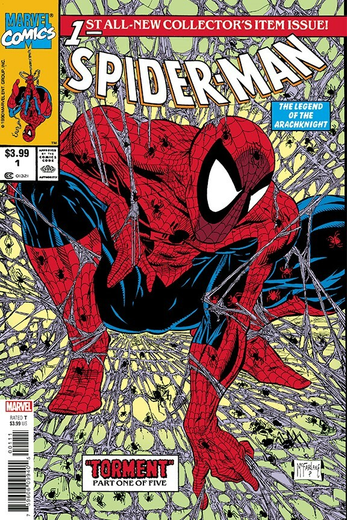
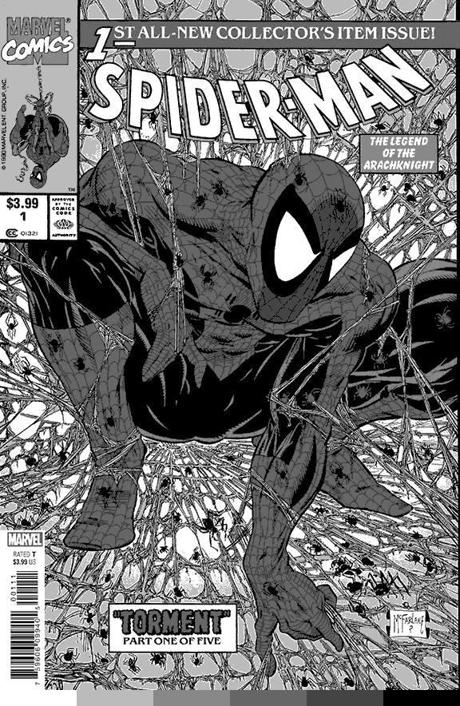

This will be a tool for turning a single image into a 3d printable poster
Inspo: https://www.youtube.com/watch?v=FKd9X-wl8Rg

<table align="center">
  <tr>
    <td></td>
    <td></td>
    <td></td>
  </tr>
  <tr>
    <td align="center">Original Image</td>
    <td align="center">LAB Color Quantization</td>
    <td align="center">LAB with Pallete</td>
  </tr>
</table>
<table align="center">
  <tr>
    <td></td>
    <td></td>
  </tr>
  <tr>
    <td align="center">Original Image</td>
    <td align="center">LAB with Grayscale Pallete</td>
  </tr>
</table>

Steps:
- [x] quantize image using LAB color space
- [x] bitmap per color 
- [ ] vectorize new image
  - extrude bitmap by color luminance
  - spererate svg by color
  - boolean mask for more detail / coverage
- [ ] auto size fitting for configured print size
- [ ] create color swaps at differtn layers in prusa slicer
- [ ] stl optimization, instead of creating each voxel
*crazy final boss goal: full integration into a unity scene for live viewing*
## How?
1. The cli will take in an image file and a list of colors
- supports hex , and rgb
2. uses the euclidian distance of LAB colors to find the closest similar color

### Env Setup

1. `uv pip sync uv.lock`
2. drop in any png to the project root
3. modify or use `run.sh` as an example

- I advise not going over 512x512 with more than 6 colors in palette (if there is lots of noise)