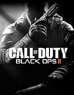
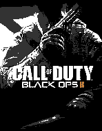
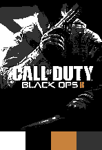

This will be a tool for turning a single image into a 3d printable poster
Inspo: https://www.youtube.com/watch?v=FKd9X-wl8Rg

<table>
  <tr>
    <td></td>
    <td></td>
    <td></td>
  </tr>
  <tr>
    <td align="center">Original Image</td>
    <td align="center">LAB Color Quantization</td>
    <td align="center">LAB with Pallete</td>
  </tr>
</table>

Steps:
- [x] quantize image using LAB color space
- [x] bitmap per color 
- [ ] vectorize new image
  - extrude bitmap by color luminance
  - extrude svg by color
  - boolean mask for more detail / coverage
- [ ] create instuctions for user to use in Fusion
- [ ] manually position in fusion then export to print
- [ ] create color swaps at differtn layers in prusa slicer

## How?
1. The cli will take in an image file and a list of colors
- supports hex , and rgb
2. uses the euclidian distance of LAB colors to find the closest similar color